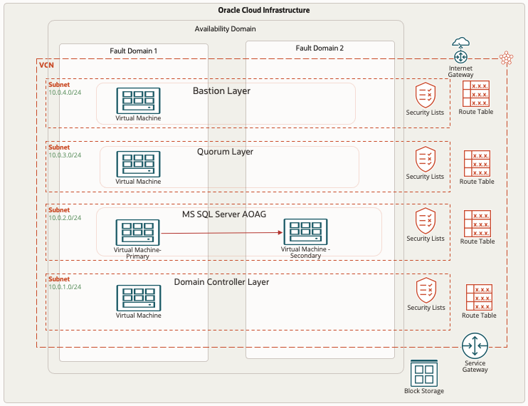

# Introduction

## About this Workshop

This hands-on workshop provides users with step-by-step instructions on how to deploy the WSFC ( Windows Server Failover clustering ) and configure the Microsoft SQL Server Always on Availability Group setup.

**Architecture:**
This reference architecture includes a Microsoft SQL Server Always On availability group, bastion server, Active Directory domain controller, and a quorum witness host on Oracle Cloud Infrastructure.

Oracle Cloud Infrastructure region that provides object storage (for backup) for the region. The region includes a single availability domain with two fault domains. The availability domain includes block storage (for volumes) for the domain. It also includes a virtual cloud network (VCN) with four regional subnets and a service gateway. The VCN provides routing tables for each subnet and each subnet provides its security list access. 

* Bastion host layer: A Bastion host resides in one fault domain. An internet gateway provides a public connection.
* Quorum server layer: A single Quorum witness server resides in fault domain to manage synchronization and replication to ensure that there is only one owner of a particular resource group at any given time.
* Microsoft SQL Server Always On availability group: A Primary Microsoft SQL server database resides in fault domain and communicates with secondary Microsoft SQL server database in another fault domain. 
* Domain controller layer: A domain controller resides in one fault domain, and compute instances are attached to the domain.

  

Estimated Workshop Time: 5 Hour

### Workshop Objectives
In this workshop, you will learn how to:
* Setup the Windows bastion host
* Setup the Windows Active Directory in Compute instance
* Installation of Microsoft SQL Server 2019 from MarketPlace images
* Setup the 2 node Windows Server Failover cluster in Compute Instance
* How to configure the Quorum for Windows Failover Cluster
* Setup and Configure the Microsoft SQL Server Always on Availability group setup

### Prerequisites
* An Oracle Free Tier, Always Free, Paid or LiveLabs Cloud Account
* Some understanding of cloud and security terms is helpful
* Familiarity with Oracle Cloud Infrastructure (OCI) is helpful
* Required Subnets: One public subnet for Bastion Host, and three private subnet to host the Domain Controller, Microsoft SQL Server Nodes and Quorum Server

## Learn More
- You can find more information about Deploy a highly available Microsoft SQL Server database [here](https://docs.oracle.com/en/solutions/deploy-microsoft-sql-on-oci/index.html#GUID-06B8A24C-A5E8-46C2-A648-CF8EB324EDFF)

## Acknowledgements
* **Author** - Ramesh Babu Donti, Principal Cloud Architect, NA Cloud Engineering
* **Contributors** -  Devinder Pal Singh, Senior Cloud Engineer, NA Cloud Engineering
* **Last Updated By/Date** - Ramesh Babu Donti, Principal Cloud Architect, NA Cloud Engineering, June 2022
