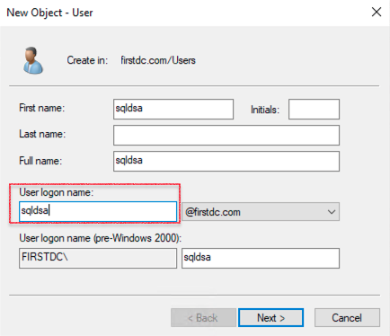

# Setup and Configure Always On Availability Group

## Introduction

This lab walks you through the steps to create the Always On Availability Group in SQL Server.

Estimated Time:  45 Minutes

### Objectives
In this lab, you will learn to :
* Create Sample database creation
* Enable Always On feature
* Create Always On Availability group
* Failover test of Always On Availability group

### Prerequisites  

This lab assumes you have:
- A Free or LiveLabs Oracle Cloud account
- IAM policies to create resources in the compartment

##  Task 1: Create Sample Database

1. RDP to the Bastion host server using the username **.\opc** and password, from the Bastion host open the Remote Desktop and connect to the Node1 server using the private IP Address.
2. Open SSMS from **Windows Start Menu**, once opened choose the Servertype **Database Engine**, provide the Node1 server name, Choose the **Authentication** type windows Authentication, and then click on **Connect**

  

3. Once we successfully connected to database engine, click on **New Query** and create the sample database using the following script, and then click on **Execute** command to create the sample database.  

    **Create database TestAOAG;**

  

4. The database creation completed and shown as following image.
  

5. select **databases**, right click on newly created database, and then select **tasks**, choose **Backup**
  

6. choose the backup location and click on **ok**.
  
You may now **proceed to the next lab**.

##  Task 2: Enable Always On feature for Node1 Database Engine and configure the SQL Engine services to run with Domain Users.

1. From the task bar click search button and search for **SQL Server 2019 Configuration Manager** and click on SQL Server 2019 Configuration Manager app.

  

2. Right click on database Engine **SQL Server (MSSQLSERVER)**, and then click on **Properties**

  

3. Click on **Always on Avilablity Groups** and select the check box **Enable Always on Availablity Groups**, and then click on Apply.

  
4. The following **Warning** message will apper on the screen, and then click on **OK**.

  

5. Finally click on **OK** to apply the changes.

  
6. To apply the changes we need to restart the SQL Engine, Right click on database Engine **SQL Server (MSSQLSERVER)**, and then click Restart.

  
7. To create the SQL service domain service account: From the task bar click search button and search for run, once the run command opens type **dsa.msc** to open the Active Directory users and computer, and then click on **users**

  

8. Provide the username details, and then click on **Next**.

  

9. Provide the password and confirm the password, and then click on **Next** and click on finish to close the create window.
  

10. From the task bar click search button and search for **SQL Server 2019 Configuration Manager** and click on SQL Server 2019 Configuration Manager app.

  

11. Right click on database Engine **SQL Server (MSSQLSERVER)**, and then click on **Properties**

12. Click on **Log On** and provide the user name and password created in above step, and then click on **apply** and **OK** to apply changes.

 

##  Task 3: Enable Always On feature for Node2 Database Engine and configure the SQL Engine services to run with Domain Users.

Repeat the all the steps from Task 2 to enable the **Always On feature for Node2**.

##  Task 4: Grant permissions to Virtual Computer Object

1. Ensure that you are logged in as a user that has permissions to create computer objects in the domain.

2. From the task bar click search button and search for run, once the run command opens type **dsa.msc** to open the Active Directory users and computer.

  

3. Click View and select **Advanced Features** to view the Advanced features  
  

4. Right click on Computers, select the **Properties**.
  

5. Click on **Security**, and then click on **Add**.

  

6. Click on **Object Types**

  

7. Select the check box **Computers**, and then click on **OK**

  

8. Search for the SQL Server Virtual computer name, and then click on **OK**.

  

9. select the computer and lick on **Advanced**

  

10. Click on **Edit** to edit the permissions

  

11. Choose the **Create Computer Objects** permission.

  

12. Click on **Apply** and click on **OK** to apply the changes.

  

13. Click on **Apply** and click **OK** to grant the permission to computer account.  

  

##  Task 5: Configure Always On Availability Group

1. Open SSMS from **Windows Start Menu**, once opened choose the Servertype **Database Engine**, provide the Node1 server name, Choose the **Authentication** type windows Authentication, and then click on **Connect**

  

2. Navigate to **Always On High Availability**, then right click and then click on **New Availability Group Wizard**

  
3. This screen shows the **Introduction** of setup Wizard
  

4. In **Specify Options** provide the **Availability group name**, and then click on **Next**
  
5. In **Select Databases** section select the database which we need to create.
  
6. In **Specify Replicas**, click on **Replicas**, and then click on **Add Replica**, the setup will pop up **Connect to Server**
  

7. click on **Connect**
  

8. The **Replicas** screen shown as follows.
  
9. In **Select Data synchronization**, and then select the **Automatic Seeding**
  
10. The **Validation** screen shown as follows
  
11. The **Summary** screen shows as follows
  

12. The **Results** section shows **The wizard completed successfully** message as shown in the following image, and then click on **Close**
  
13. Open the show dashboard by right on newly created on Availability group, we can see the successfully primary and read replica as shown as following image.
  

## Acknowledgements
* **Author** - Ramesh Babu Donti, Principal Cloud Architect, NA Cloud Engineering
* **Contributors** -  Devinder Pal Singh, Senior Cloud Engineer, NA Cloud Engineering
* **Last Updated By/Date** - Ramesh Babu Donti, Principal Cloud Architect, NA Cloud Engineering, June 2022
