# Setup the 2 node Windows Server Failover Cluster

## Introduction

This lab walks you through the steps to create a Windows Server Failover Cluster.

A failover cluster is a group of independent computers that work together to increase the availability and scalability of clustered roles.

Estimated Time:  1 hour

### Objectives
In this lab, you will learn to :
* How to install the Failover Clustering features in windows server
* How to create the secondary Private IP's for Computer instance VNICS
* How to configure the 2 node Windows failover Cluster

### Prerequisites  

This lab assumes you have:
- A Free or LiveLabs Oracle Cloud account
- IAM policies to create resources in the compartment

##  Task 1: Installing Failover Clustering features in Node1

1. RDP to the Bastion host server using the username **.\opc** and password, from the Bastion host open the Remote Desktop and connect to the Node1 server using the private IP Address.

2. From the task bar click **search button** and search for Server Manager and click on Server Manager.

  

Launch Add Roles and Feature Wizard from the server manager. Enable the **Failover Clustering** feature in both the SQL nodes.

3. On successful open the Server Manager, click on **Add roles and features**

  

4. The Add Roles and Features Wizard looks like following image, click on **next**

  

5. Choose the Installation Type **Role-based or feature-based Installation**, click on **next**

  

6. Choose the Server Selection Type **Select a server from the server pool**, click on **next**

  

7. Put a tick mark on **Failover Clustering** and click on **Add Features** to install the feature with dependency.

  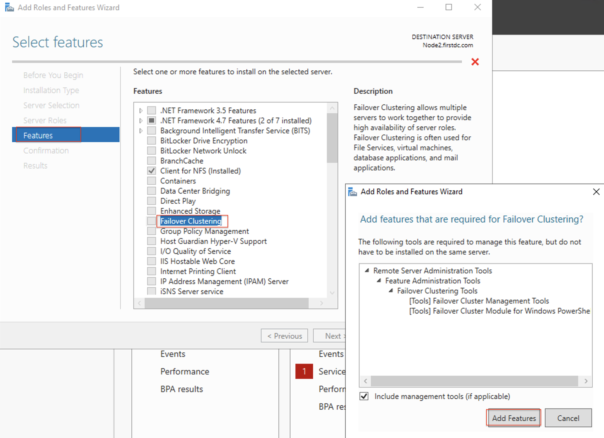

  click on **Next** to continue with installation.

  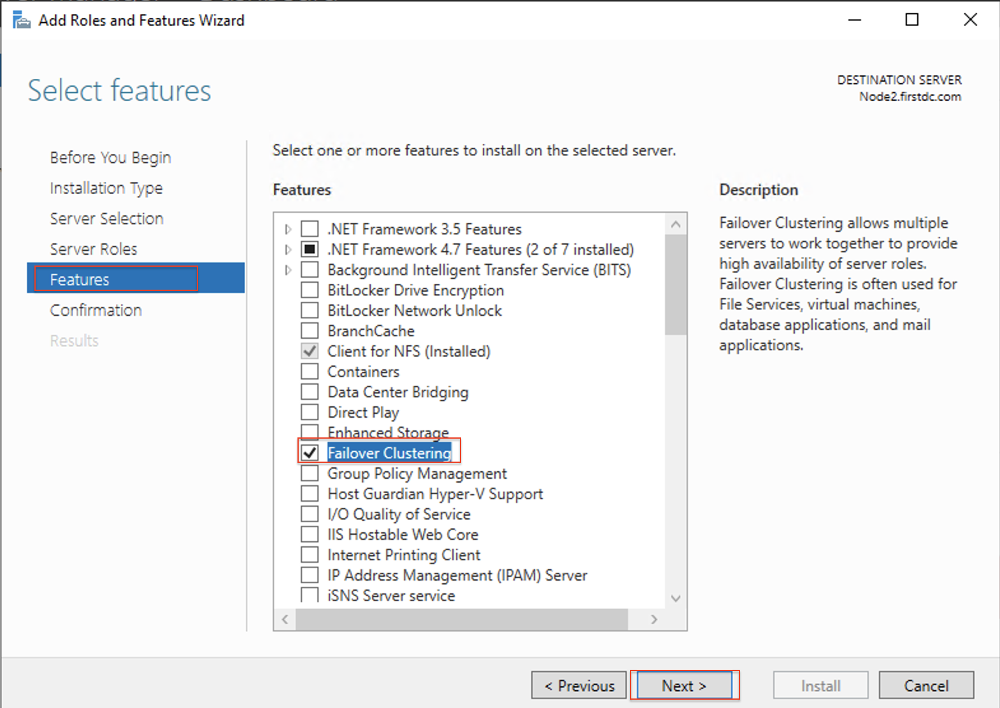

8. The Confirmation will show the details for roles, role services, or features on selected servers, choose the **Restart the destination server automatically if required**, a pop up will appear to check on **yes** for auto restart, click on **Install** to proceed with installation.

  

9. In Installation progress **Results** section shows that installation succeeded.

  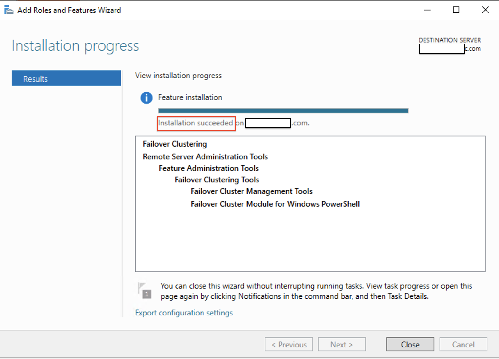

10. To verify the failover cluster services, From the task bar click **search button** and search for **Failover Cluster

  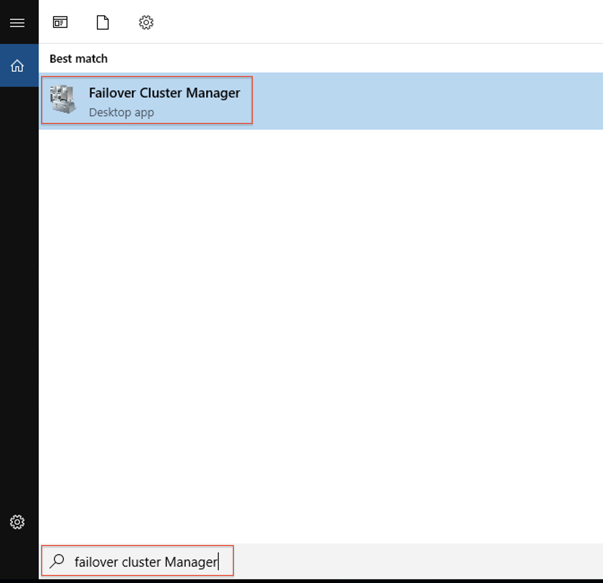

  The **Failover Cluster Manager** open as shown in the following image.

  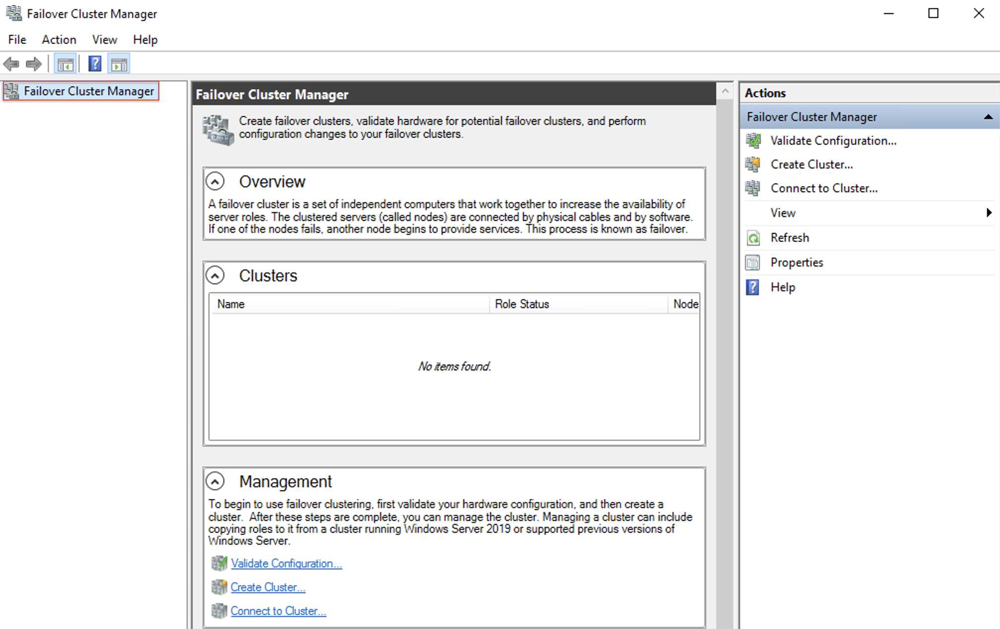

##  Task 2: Installing Failover Clustering features in Node2

* Repeat the all steps from **Task 1** to install **Failover Clustering features** in Node2

## Task 3: Create Secondary Private IP's for Node1

Add two secondary IPs for each node. One is used for Windows Server Failover Clustering, and the other will be used for Always On Availability group listener.

1. Open the navigation menu, click Compute, and then click Instances

  

2. Click on the **Compute Instance** which we need to add the secondary IPs.

  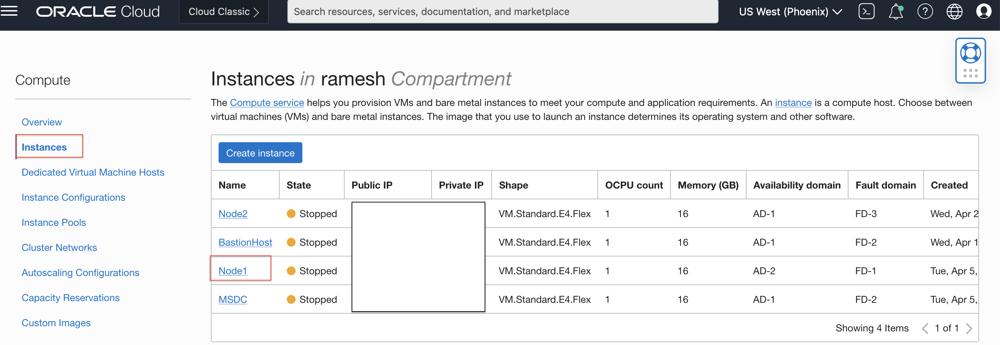

3. In the **Resource** section, click on **Attached VNICs**, and then click on Primary VNIC to add the secondary IPs.

  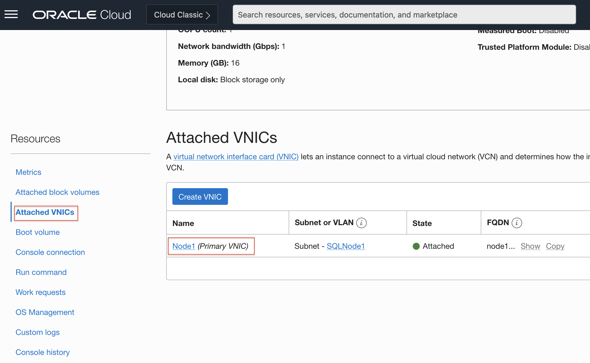

4. Once VNIC is opened, click on **IPv4 Address**.

  

5. The **IPv4 Address** show the Primary IP address details, and then click on **Assign Secondary Private IP Address**

  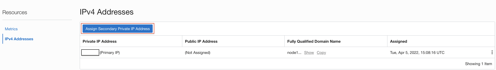

6. Click on **Assign** will automatically assign the available private IP.  Repeat the same step again to add another private IP.

  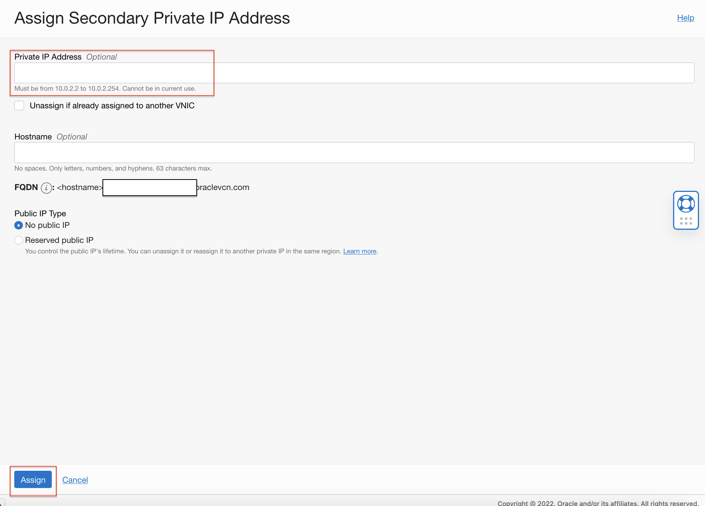

7. In **IPv4 Addresses** Section we can able to see one Primary IP and two secondary IP address as shown in the following image.

  

## Task 4: Create Secondary Private IP's for Node2

Repeat the all steps from **Task 3** to add secondary IP's for Node2 VNICS

## Task 5:  Configure the 2 node Windows failover Cluster

1. RDP to the Bastion host server using the username **use the testadmin user which is created in lab 1, Task 2 in the step 35** and password, from the Bastion host open the Remote Desktop and connect to the Node1 server using the private IP Address.

2. From the task bar click **search button** and search for **Failover Cluster**

  

  The **Failover Cluster Manager** open as shown in the following image, and then right click **Failover Cluster Manager**, and click on **Create Cluster**

  

3. The **Cluster Wizard** shown as following image, then click on **Next**

  

4. Click on Browse and select the two servers which we created in **Lab 2**
  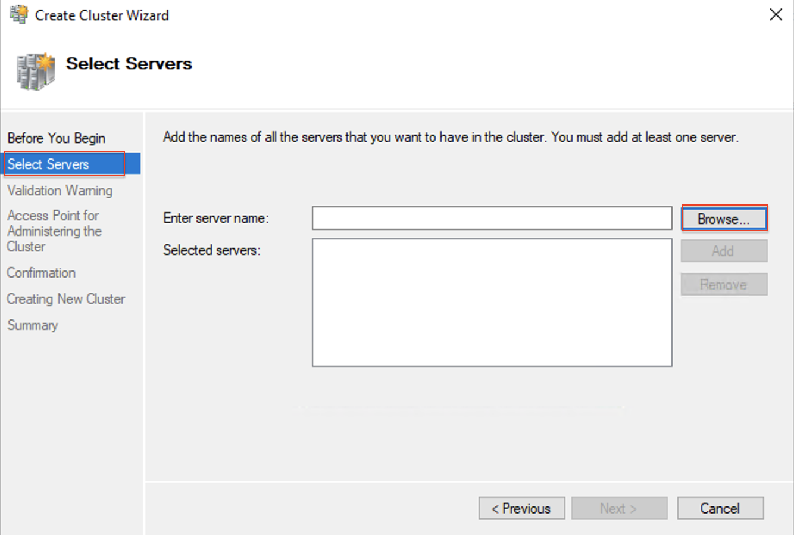

5. The servers will add and as shown in the below image, and then click on **Next**
  
6. In the Validation warning section select **yes**, and then click on **Next**
  

7. The validation configuration wizard shown as follows, and then click on **Next** to continue validation
  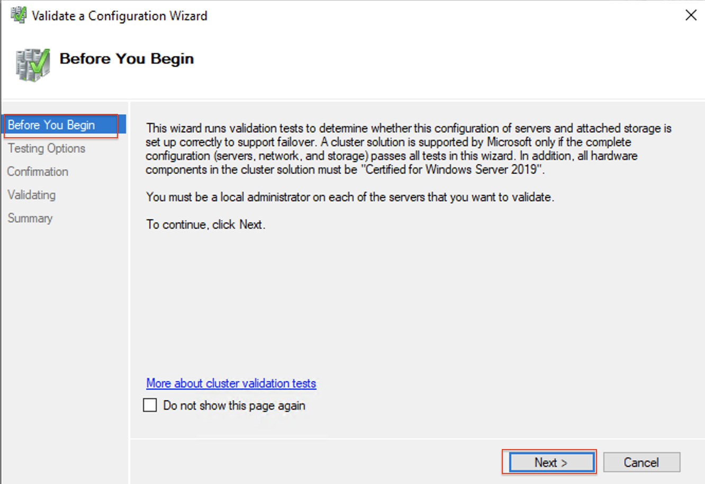

8. In **Testing Options** tab choose the **Run all tests (recommended)** option, and then click on **Next**

  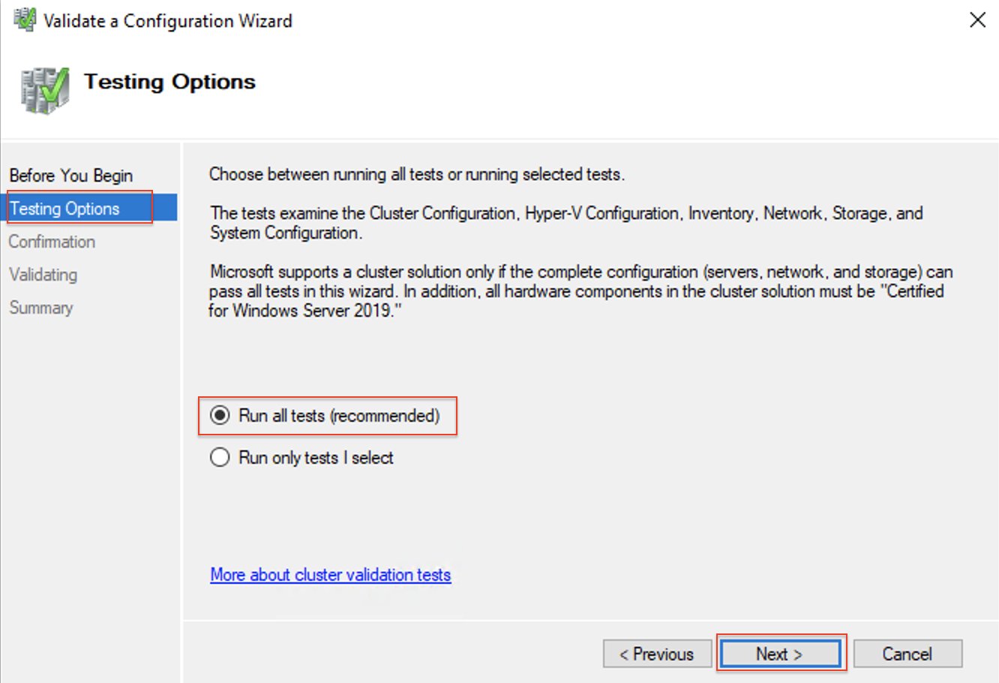

9. The confirmation screen shows all servers which we added to cluster validation, and then click on **Next**

  

10. The validation will run test

  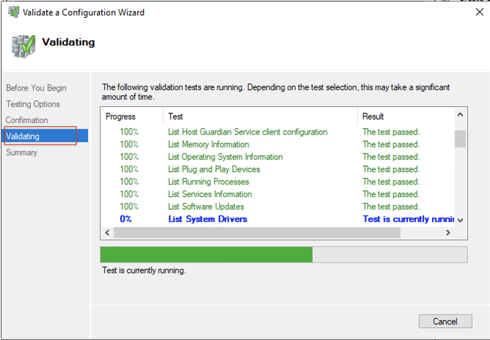

11. Once the validation completed we can see the status as **Validated** and we can click on **View Report** to view the complete report in **html** format.

  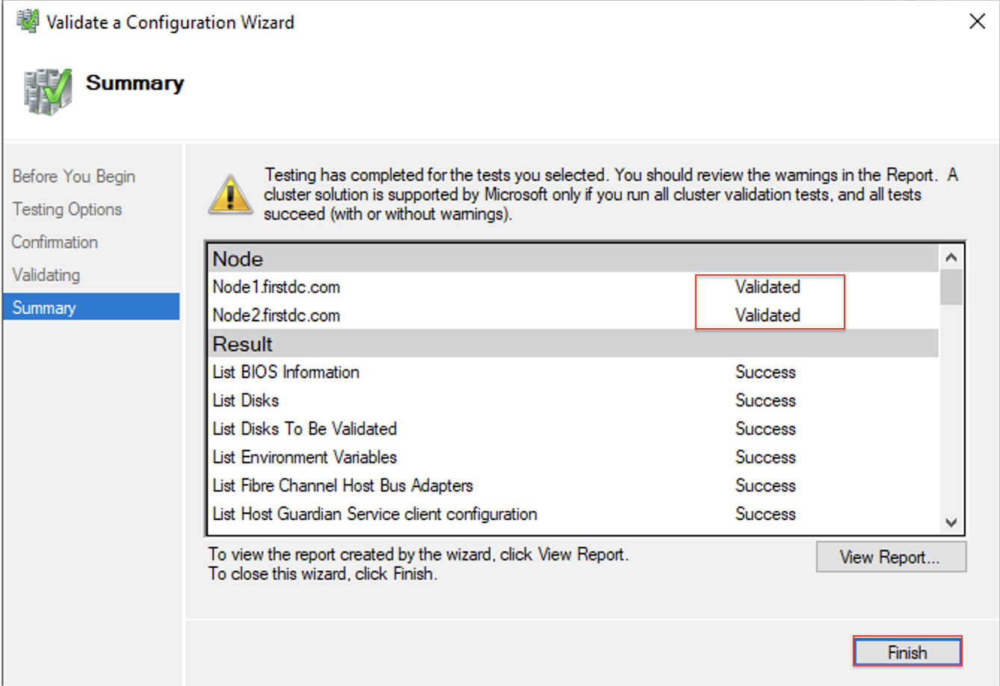

12. In **Access Point for Administering the Cluster** choose the **Cluster Name**, and then click on **Next**

  

13. The **Confirmation** screen shows the cluster name, node details and another few domain related information, and then click on **Next** to continue with configuration.
  

14. Once the cluster created successfully we can see the confirmation that **You  have successfully completed the Create Cluster Wizard** message as shown follows.
  

15. After successfully created the cluster, the cluster details shown as follows.

  

16. Select the Cluster and navigate to **Cluster Core Resources**, the cluster resource will show is offline as shown in the following image.  To bring the cluster online we need to update the **Static IP Address** which we created in **Task 3** and **Task4**.
  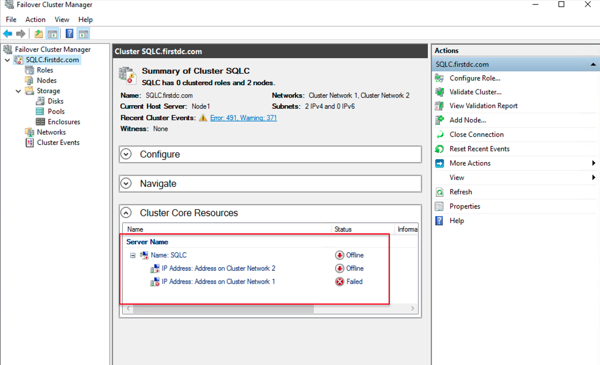

17. Right click on **IP Address on Cluster Network 1**, and then click on **Properties**.  Select the Static IP Address and provide the secondary IP address which we created in **Task 3** for node1.
  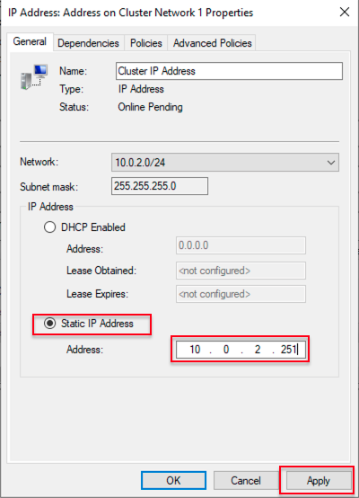

18. Repeat the same above step for Node2 network.
  

19. Once the stastic secondary IP are configured, and then right lick on SQLName and click on **Bring online** cluster.
  

20. The cluster should come online as shown in following image. Since the cluster is multi-subnet cluster we can able to see only one network is online.
  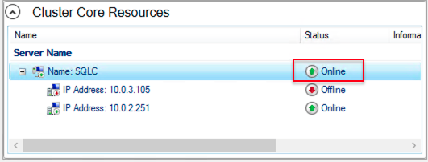

With the above step we are successfully setup the windows two node failover cluster. You may now **proceed to the next lab**.

## Learn More
- You can find more information about OCI Security Cloud Advisor [here](https://docs.oracle.com/en-us/iaas/Content/SecurityAdvisor/Concepts/securityadvisoroverview.htm)

## Acknowledgements
* **Author** - Ramesh Babu Donti, Principal Cloud Architect, NA Cloud Engineering
* **Contributors** -  Devinder Pal Singh, Senior Cloud Engineer, NA Cloud Engineering
* **Last Updated By/Date** - Ramesh Babu Donti, Principal Cloud Architect, NA Cloud Engineering, April 2022
