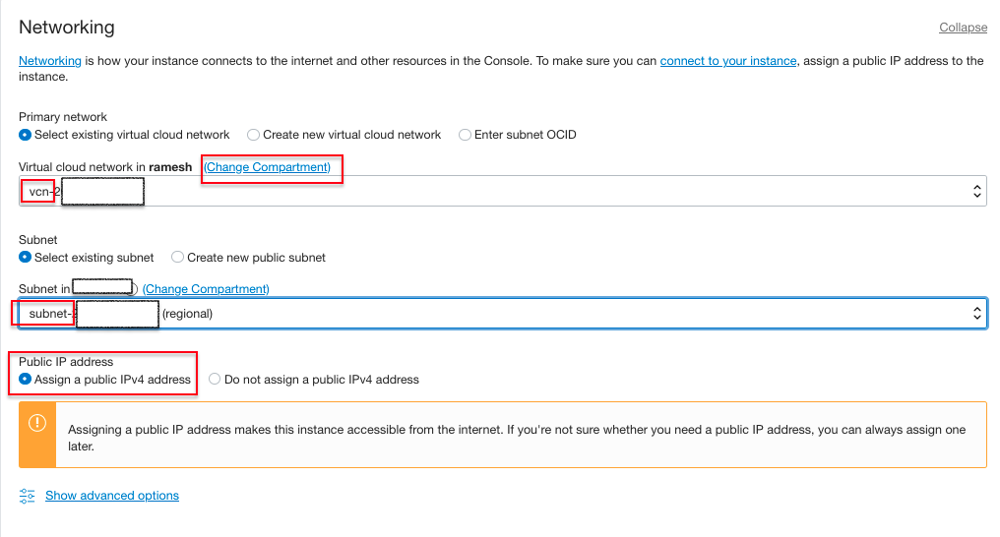
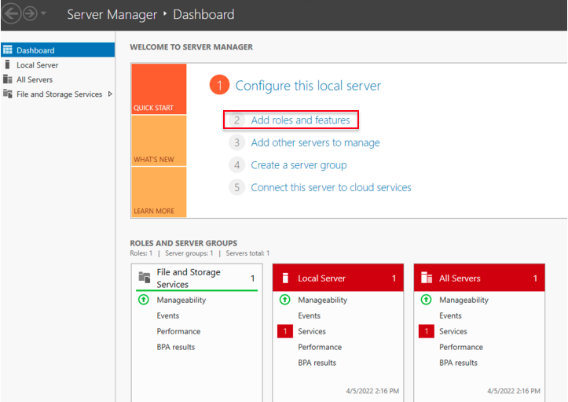

# Setup Windows bastion host and Windows AD Domain Services

## Introduction

This lab walks you through the steps how to create Windows bastion host and setup the Windows Active Directory Domain services in Compute instance. It involves creating the windows bastion host and Windows server in Compute instance and installing and configuring the Microsoft Active Directory Domain Services.

Estimated Time:  1 Hour

### Objectives
In this lab, you will learn to :
* Setup the Windows bastion host
* Setup the Windows Active Directory Domain Services in Compute instance

### Prerequisites  

This lab assumes you have:
- A Free or LiveLabs Oracle Cloud account
- IAM policies to create resources in the compartment
- Required Subnets are available in VCN

##  Task 1: Create the Bastion host in Public Subnet

1. Open the navigation menu, click **Compute**, and then click **Instances**

  

2. Compute page will be shown as below. The Compute service helps you provision VMs and bare metal instances to meet your compute and application requirements.  Navigate to **Instances**, and then click on **Create Instance**

  

3. Choose the Instance name and compartment where the compute instance needs to created, select the desired Availability Domain.

  

4. Click on **Change image** to select the edition of Windows image build and Click on **Change shape** to select the shape of the instance.

  

5. Choose the compartment where the compute instance should resides, and then choose the public subnet as shown in below image. Click on assign a public IPv4 address to connect from the public internet.

  

6. Choose the default values an click on **Create** instance

  

7. The Compute instance will be provisioning state as shown in below image.

  

8. Once the compute instance provisioning completed we could able to see the instance state is running.

  

9. We can use the Remote Desktop to connect to the newly created instance using the **opc** username and with initial password shown in the console.  We need to change the password at first logon. The network that the instance is in must allow RDP TCP port **3389** in the security list.

  

  You may now **proceed to the next Task**.

##  Task 2: Create the Windows Domain Controller in Private Subnet

1. Open the navigation menu, click on **Compute**, and then click **Instances**

  

2. Compute page will be shown as below. The Compute service helps you provision VMs and bare metal instances to meet your compute and application requirements.  Navigate to **Instances**, and then click on **Create Instance**

  

3. Choose the Instance name and compartment where the compute instance needs to created, select the desired Availability Domain.

  

4. Click on **Change image** to select the edition of Windows image build and Click on **Change shape** to select the shape of instance.

  

5. Choose the compartment where the compute instance resides, and then choose the private subnet as shown in below image. Since we have chosen private subnet the Public IP address select as Do not assign a public IPv4 address automatically which cannot change as shown in the below image.

  

6. Choose the default values an click on Create instance

  

7. The Compute instance will be provisioning state as shown in below image.

  

8. Once the compute instance provisioning completed we could able to see the instance state is running.

  

9. We can use the Remote Desktop to connect to the newly created instance using the **opc** username and with initital password shown in the console.  We need to change the password at first logon. The network that the instance is in must allow RDP TCP port **3389** in the security list.

  

10. RDP to the Bastion host server using the username **opc** and password, from the Bastion host open the Remote Desktop and connect to the Domain Controller server using the private IP Address.

11. From the task bar click **search button** and search for **run**, once the run command opens type **lusrmgr.msc** to open the local users.

  

12. once opens the **Local users and Groups**, click on **Users** and right lick on **Administrator** for set the password. This password reset needed for to run the **Prerequisites** successfully during the Domain creation.

  
  

13. From the task bar click **search button** and search for Server Manager and click on Server Manager.

  

14. On successful open the Server Manager, click on **Add roles and features**

  

15. The Add Roles and Features Wizard looks like following image, click on **next**

  

16. Choose the Installation Type **Role-based or feature-based Installation**, click on **next**

  

17. Choose the Server Selection Type **Select a server from the server pool**, click on **next**

  

18. Choose the Server Roles **Active Directory Domain Services**, click on **Add Features**, click on **next**

  

19. Choose the Features **Telnet Client**, Telnet client will be required to do the ping test, click on **next**

  

20. In AD DS section, click on **next**

    

21. The Confirmation will show the details for roles, role services, or features on selected servers, choose the **Restart the destination server automatically if required**, a pop up will appear to check on **yes** for auto restart, click on **Install** to proceed with installation.

    

22. In Installation progress **Results** section shows that installation succeeded and configuration required message as shown in the below image, click on **close**

    

23. From the task bar click **search button** and search for Server Manager and click on Server Manager. Click on the Flag and click on **Promote the server to a domain controller**

    

24. From the **Deployment Configuration**, select **Add a new forest** and provide the desired domain name in **Root domain name:**, click on **next**  

    

25. In the **Domain controller Options**, provide the password for **DSRM**, click on **next**

    

26. In the **DNS Options**, ignore the warning and click on **next**

    

27. The **NetBIOS domain name:** will resolve automatically, click on **next**

    

28. choose the required paths for log files, click on **next**

    

29. In the **Review Options** we can see the details settings, click on **next**

    

30. In the **Prerequisites** section, click on **next** the configuration will verify the required Prerequisites checks, the successful Prerequisites checks shows as below image, click on **Install** to complete the installation.

    

31. Once the server is configured as domain controller, we can see the successful message as shown in the below image and the system is automatically restart.

    

32. To verify the domain details, from the task bar click search button and search for run, once the run command opens type **dsa.msc** to open the Active Directory users and computer.

    

33. Open **Control Panel**, and navigate to   **Control Panel\System and Security\Windows Defender Firewall**

    

34. In the **Customize settings**, and choose the **Turn off Windows Firewall**, and then click on **OK** to apply the changes.

    

35. To create the domain Administrator users: From the task bar click search button and search for run, once the run command opens type **dsa.msc** to open the Active Directory users and computer, and then click on **users**

    

36. Provide the username details, and then click on **Next**.

    

37. Provide the password and confirm the password, and then click on **Next**.

    

38. Click on **Finish** to create the domain user.

    

39. Double Click on newly created user and click on **Member of**, and then add the **Domain Admins** and click on **Apply** to add the **Domain Admins** to newly created user.

    

You may now **proceed to the next lab**.

## Learn More
- You can find more information about Launching a Windows Instance [here](https://docs.oracle.com/en-us/iaas/Content/GSG/Tasks/launchinginstanceWindows.htm)

## Acknowledgements
* **Author** - Ramesh Babu Donti, Principal Cloud Architect, NA Cloud Engineering
* **Contributors** -  Devinder Pal Singh, Senior Cloud Engineer, NA Cloud Engineering
* **Last Updated By/Date** - Ramesh Babu Donti, Principal Cloud Architect, NA Cloud Engineering, April 2022
