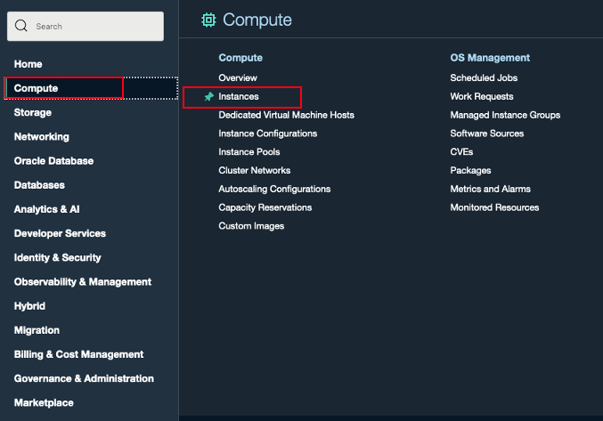
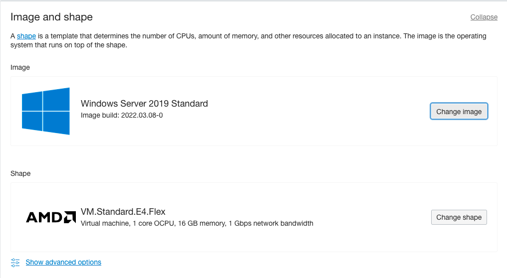

# Setup Windows witness server for windows server failover cluster

## Introduction

This lab walks you through the steps of how to set up the Windows Server, this server will be used as the witness server for the cluster.  

Estimated Time:  30 min

### Objectives
In this lab, you will learn to :
* Setup the Windows Server for witness
* Configure the witness for the Windows server failover cluster.

### Prerequisites  

This lab assumes you have:
- A Free or LiveLabs Oracle Cloud account
- IAM policies to create resources in the compartment
- Required Subnets are available in VCN

##  Task 1: Create the witness server in Private Subnet

1. Open the navigation menu, click **Compute**, and then click **Instances**

  

2. Compute page will be shown as below. The Compute service helps you provision VMs and bare metal instances to meet your compute and application requirements.  Navigate to **Instances**, and then click on **Create Instance**

  

3. Choose the Instance name and compartment where the compute instance needs to be created, and select the desired Availability Domain.

  

4. Click on **Change image** to select the edition of Windows image build and Click on **Change shape** to select the shape of the instance.

  

5. Choose the compartment where the compute instance should reside, and then choose the public subnet as shown in the below image. Click on assign a public IPv4 address to connect from the public internet.

  

6. Choose the default values and click on **Create** instance

7. We can use the Remote Desktop to connect to the newly created instance using the **opc** username and with the initial password shown in the console.  We need to change the password at the first logon. The network that the instance is in must allow RDP TCP port **3389** in the security list.
  

  You may now **proceed to the next Task**.

##  Task 2: Add the witness Server to Active Directory Domain

  Repeat steps from Lab 2: Task 3 to add the server to Active Directory Domain.

##  Task 3: Configure the witness for the Windows server failover cluster

1. RDP to the Bastion host server using the username **opc** and password, from the Bastion host open the Remote Desktop and connect to the witness server using the private IP Address.

2. Create a folder name as a witness and share the folder for read and write, and then click on Share folder

  

  The settings will show in the following image.

  

3. The successful share folder shows as follows.
  

##  Task 4: Configure the witness in the Windows Server Failover cluster

1. RDP to the Bastion host server using the username **opc** and password, from the Bastion host open the Remote Desktop and connect to the Node1 or node2 server using the private IP Address.

2. From the task bar click **search button** and search for **Failover Cluster**
  

The Failover Cluster Manager opens as shown in the following image, and then right-click on the cluster name, choose **More Actions** and then chose the **Configure Cluster Quorum Settings**
  

3. The configuration wizard shows as follows:

  

4. Select the **Select the Quorum Witness** option, and then click on **Next**

  

5. Select the **Configure a file share witness**, and then click on **Next**
  
6. Provide the path for share folder which created in Task 3, and then click on **Next**
  
7. The configuration **Confirmation** tab shows as follows, and then click on **Next**
  
8. The **Summary** page shows as follows with successful message, and then click on **Finish**
  
9. The file share witness will be online in cluster manager.  
  

We have successfully configured the Windows failover cluster with 2 node SQL Server AOAG configured with a witness.

## Acknowledgements
* **Author** - Ramesh Babu Donti, Principal Cloud Architect, NA Cloud Engineering
* **Contributors** -  Devinder Pal Singh, Senior Cloud Engineer, NA Cloud Engineering
* **Last Updated By/Date** - Ramesh Babu Donti, Principal Cloud Architect, NA Cloud Engineering, June 2022
